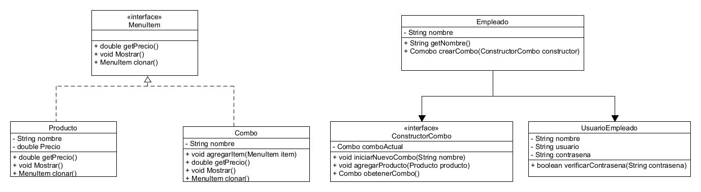

# Patron composite

***

## Idea Del Ejemplo

Este ejercicio tiene como objetivo simular un sistema usado por empleados de un restaurante para crear combos de comida personalizados, utilizando tres patrones de diseño: Composite, Builder y Prototype.

👨‍🍳 ¿Para quién es este sistema?
Este sistema está diseñado únicamente para el uso de los empleados del restaurante, no para los clientes. La idea es que el empleado pueda crear diferentes combinaciones de productos (combos) de forma flexible, reutilizable y ordenada.

¿Qué se puede hacer en el sistema?
Registrar y autenticar empleados con usuario y contraseña.

Crear nuevos combos usando productos existentes como bebidas, entradas, platos fuertes o postres.

Guardar los combos creados y clonarlos fácilmente para crear nuevas versiones parecidas.

***

## UML Patrones Composite, Builder & Prototype

***

## Integrantes

* Felipe Cardenas Mora 20231020145
* Yuber Alejandro Bohorquez Roa 20231020195
* Juan Sebastian Vega Diaz 20231020087
* David Neira 20192020086
